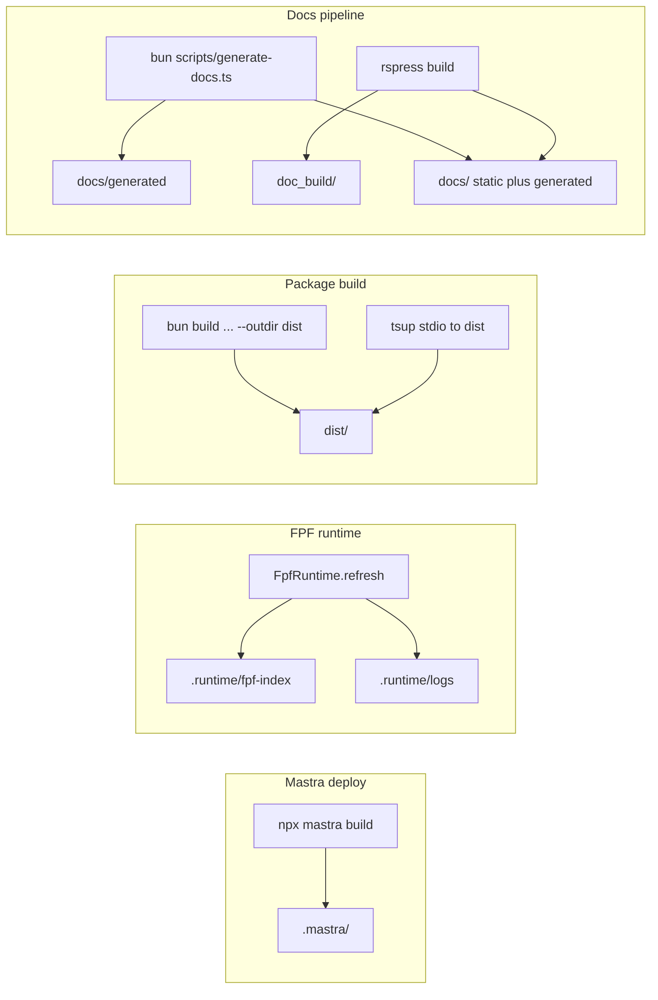

# Artifact directories

How `.mastra`, `.runtime`, `dist`, `doc_build`, and `docs` are produced. These paths come from three layers: Mastra’s deploy CLI, the FPF runtime and logging, and Bun or tsup plus the docs generator and Rspress.

## Summary

## `.mastra`

- **Source:** the Mastra CLI, not the application TypeScript in this repo.
- **When:** [`package.json`](../../package.json) `deploy` runs `npx mastra build && npx mastra server deploy` (after `predeploy` / [`scripts/prepare-deploy.sh`](../../scripts/prepare-deploy.sh)).
- **Role:** build and cache output for Mastra’s bundler and deploy path. **Gitignored** (see [`.gitignore`](../../.gitignore)).
- **How the codebase models it:** tests use **`.mastra/output`** as the hosted bundle root so [`resolveRuntimePath`](../../src/runtime/path-resolution.ts) can find a staged spec file at the default relative path **`.fpf-upstream/FPF-Spec.md`** and co-locate `.runtime/fpf-index` when cwd is not the repo root ([`tests/runtime-path-resolution.test.ts`](../../tests/runtime-path-resolution.test.ts)).

## `.runtime`

- **Primary content:** compiled FPF index files under **`FPF_RUNTIME_ARTIFACT_DIR`**, default **`.runtime/fpf-index`** ([`src/core/constants.ts`](../../src/core/constants.ts), [`parseRuntimeCoreConfig`](../../src/adapters/infra/config/env.ts)).
- **How it is written:** [`FpfRuntime`](../../src/runtime/runtime.ts) `refresh()` creates the artifact directory and writes `snapshot.json` and related JSON.
- **Path resolution:** a relative `artifactDir` is resolved under the discovered **source root** (walk from cwd and from the running module), so deployed layouts under `.mastra/output` still resolve artifacts correctly ([`src/runtime/path-resolution.ts`](../../src/runtime/path-resolution.ts)).
- **Logs:** defaults **`.runtime/logs/mastra.log`**, **`.runtime/logs/mastra-observability.json`**, **`.runtime/logs/ai-traces.jsonl`** from [`src/adapters/infra/config/env.ts`](../../src/adapters/infra/config/env.ts). Gitignored.
- **Hosted staging:** `predeploy` copies the runtime source markdown (staged under **`src/mastra/public/.fpf-upstream/FPF-Spec.md`** so hosted bundles match the runtime default) and `snapshot.json` into **`src/mastra/public`** under paths such as **`src/mastra/public/.runtime/fpf-index/snapshot.json`** ([`src/build/stage-deploy-assets.ts`](../../src/build/stage-deploy-assets.ts)); that public tree is gitignored.

## `dist`

- **Source:** **`bun run build`** in [`package.json`](../../package.json): `bun build ./src/cli.ts ./src/server.ts --outdir dist --target bun` plus **`build:mcp`**: `tsup src/mastra/stdio.ts --format esm --out-dir dist` (with a shebang fix on `dist/stdio.js`).
- **Purpose:** publishable binaries; `bin` points at **`dist/stdio.js`**. [`tsconfig.json`](../../tsconfig.json) sets `"outDir": "dist"` but **`noEmit": true`**, so `tsc` does not populate `dist`; only the build scripts do.
- **Gitignored.**

## `doc_build`

- **Source:** Rspress static build output.
- **Config:** [`rspress.config.ts`](../../rspress.config.ts) sets `outDir` to `process.env.FPF_DOCS_OUT_DIR ?? 'doc_build'`.
- **When:** `bun run docs:build` runs `docs:generate` then `rspress build` ([`package.json`](../../package.json)); CI may upload that folder (for example [`.github/workflows/deploy-docs.yml`](../../.github/workflows/deploy-docs.yml) `path: doc_build`).
- **Gitignored.**

## `docs`

- **Rspress site root:** `root` is `FPF_DOCS_ROOT`, default **`docs`**, in [`rspress.config.ts`](../../rspress.config.ts) and [`parseDocsConfig`](../../src/adapters/infra/config/env.ts).
- **Hand-maintained** pages live under `docs/` (for example decision records and [`docs/mcp-interface.md`](../mcp-interface.md)).
- **`docs/generated/**`:** produced by **`bun run docs:generate`** → [`scripts/generate-docs.ts`](../../scripts/generate-docs.ts) → [`generateDocsSite`](../../src/adapters/docs/generate.ts), which compiles the spec at `FPF_SPEC_SOURCE_PATH`, builds a projection, **removes `docs/generated`**, then writes one markdown file per projected page. This directory is **gitignored**; CI and `docs:build` run generation so the tree exists when Rspress runs.
- **Rspress** reads the full `docs/` tree (static plus generated) and emits the static site into **`doc_build/`**.
- **`docs/architecture/html/**`:** optional standalone architecture diagram pages from **`bun run diagrams:generate`** ([`scripts/generate-architecture-diagrams.ts`](../../scripts/generate-architecture-diagrams.ts)); **gitignored** so outdated SVG snapshots are not pushed.

## Canonical spec upstream (`fpf-sync`)

The spec is **not committed**. Default `FPF_SPEC_SOURCE_PATH` is **`.fpf-upstream/FPF-Spec.md`**, filled by **`bun run spec:download`** from [github.com/venikman/fpf-sync](https://github.com/venikman/fpf-sync) on `main` at [`FPF/FPF-Spec.md`](https://github.com/venikman/fpf-sync/blob/main/FPF/FPF-Spec.md). Alternatively set **`FPF_SPEC_SOURCE_PATH`** to the **absolute path** of a local checkout of that file. HTTPS GitHub URLs are not supported as the value for `FPF_SPEC_SOURCE_PATH` itself. Override download URL or output with **`FPF_UPSTREAM_SPEC_URL`** and **`FPF_DOWNLOAD_SPEC_OUTPUT`**. A root-level `FPF-spec.md` in this clone is optional and gitignored if present.

## Environment overrides

| Variable | Default (from [`env.ts`](../../src/adapters/infra/config/env.ts)) |
|----------|---------------------------------------------------------------------|
| `FPF_RUNTIME_ARTIFACT_DIR` | `.runtime/fpf-index` |
| `FPF_DOCS_ROOT` | `docs` |
| `FPF_DOCS_OUT_DIR` | `doc_build` |
| `FPF_DIST_DIR` | `dist` (used in build config parsing; `package.json` scripts still hardcode `dist` today) |

## Related

- [Automation scripts](../scripts.md) for `scripts/*.ts` and `verify-runtime.sh`.
- [Diagram pack](./diagram-pack.md) for runtime architecture views.
- [Runtime surface alignment](./runtime-surface-alignment.md) for boundary alignment notes.
