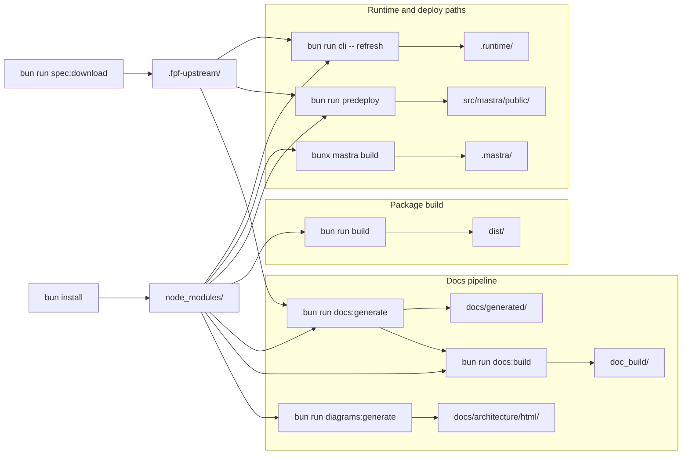

# Root-Folder Contract

This page is the canonical explanation of why top-level directories exist in `fpf_memory`.
It covers one bounded context: `RepositoryRoot:LocalFPFSpecRuntime`.

It answers two questions in one place:

1. what each root path is
2. how and when it is produced

This page intentionally reuses the existing `artifact-directories` route instead of minting a second overlapping root-layout page. In FPF terms, that keeps one canonical lexical surface for the root contract instead of splitting the same meaning across multiple docs.

## Decision rule

- Keep a root path only if it carries repo promise or required operating ability.
- Treat generated artifacts as disposable performance output: they should be safe to delete and straightforward to regenerate.
- Treat personal tool state as out of contract: it may exist locally, but the repo must not depend on it.
- If a documented promise surface is reclassified downward, update the owning contract in the same change. For `.codex`, that owner is [DRR-0001](../drr/DRR-0001-mcp-first-class-interface.md) plus the Codex setup docs.

The distinction follows the FPF split between promise, ability, and performance (`A.2.3`), the plan/run split (`A.15`), and the preference for one canonical lexical surface (`E.10`).

## Root Classification

| Path | Class | Why it exists | Tracked / ignored | Safe to delete | How to restore |
| --- | --- | --- | --- | --- | --- |
| `.codex` | promise surface | Project-scoped Codex setup for the hosted `fpf_memory` MCP server; documented in [README](../../README.md) and [MCP Interface](../mcp-interface.md) | tracked | No | Restore from git |
| `.github` | promise surface | CI workflows, issue templates, and PR template for the repository contract | tracked | No | Restore from git |
| `docs` | promise surface | Hand-authored docs root for Rspress and the published reference site | tracked root; `docs/generated/` and `docs/architecture/html/` are ignored | No | Restore tracked pages from git; regenerate ignored subtrees with `bun run docs:generate` and `bun run diagrams:generate` |
| `scripts` | promise surface | Automation entrypoints used by package scripts, CI, and local verification | tracked | No | Restore from git |
| `src` | promise surface | Runtime, MCP, hosted, and docs-generation implementation | tracked root; `src/mastra/public` is ignored staging output | No | Restore tracked sources from git; regenerate `src/mastra/public` with `bun run predeploy` |
| `tests` | promise surface | Verification contract for runtime, composition, and docs behavior | tracked | No | Restore from git |
| `.fpf-upstream` | ability input | Default local spec source used by runtime, docs generation, and deploy staging | ignored | Yes | `bun run spec:download`, or point `FPF_SPEC_SOURCE_PATH` at a local checkout |
| `node_modules` | ability input | Installed dependencies required to run repo scripts and builds | ignored | Yes | `bun install` |
| `.mastra` | generated artifact | Mastra build and deploy output/cache | ignored | Yes | `bunx mastra build` or `bun run deploy` |
| `.runtime` | generated artifact | Compiled FPF index artifacts and local runtime/log output | ignored | Yes | `bun run cli -- refresh` recreates `.runtime/fpf-index`; runtime commands recreate logs |
| `dist` | generated artifact | Built CLI, server, and MCP binaries | ignored | Yes | `bun run build` |
| `doc_build` | generated artifact | Static Rspress output for the published docs viewer | ignored | Yes | `bun run docs:build` |
| `.claude` | personal local state | Local Claude settings; not part of the repo contract | ignored | Yes | No repo command; recreate only if your local Claude workflow needs it |
| `.cursor` | personal local state | Local Cursor state; not part of the repo contract | untracked local path; `.cursor/hooks/state/` is ignored | Yes | No repo command; local Cursor/hooks may recreate it if used |

`Tracked / ignored` reflects current repo policy, not a requirement that every clone contains every path.

`Safe to delete` means one of two things:

- the repo provides a regeneration path
- the path is local-only and the repo does not promise it

Root files such as `.mcp.json`, `server.json`, `README.md`, and `package.json` are also contract-bearing, but this page focuses on top-level directories.

## Tracked Roots With Ignored Subtrees

Three tracked roots host generated subtrees:

- `docs/generated/**` is written by `bun run docs:generate`
- `docs/architecture/html/**` is written by `bun run diagrams:generate`
- `src/mastra/public/**` is staged by `bun run predeploy`

Those ignored subtrees do not weaken the classification of `docs` or `src` as promise surfaces. The parent roots remain tracked contract surfaces; the nested outputs are disposable generated artifacts.

## Generation Overview

## Promise Surfaces

### `.codex`

- **Role:** project-scoped Codex setup surface, not a local cache.
- **Why it stays:** the repo explicitly documents `.codex/config.toml` as part of Codex onboarding in [README](../../README.md) and [MCP Interface](../mcp-interface.md).
- **Contract note:** reclassifying `.codex` from promise surface to optional local state would change an existing repo promise and should therefore update [DRR-0001](../drr/DRR-0001-mcp-first-class-interface.md).

### `.github`, `docs`, `scripts`, `src`, `tests`

- These directories are tracked and load-bearing for the public repository boundary: CI, docs, automation, implementation, and verification.
- The repo should stay understandable and operable without requiring local memory about those directories.
- Ignored nested outputs inside `docs` and `src` do not change the status of the parent roots.

## Ability Inputs

### `.fpf-upstream`

- **Role:** default local source path for the upstream FPF markdown spec.
- **When:** [`package.json`](../../package.json) exposes `spec:download`, which runs [`scripts/download-upstream-spec.ts`](../../scripts/download-upstream-spec.ts).
- **Why it is ability input rather than promise surface:** the repo depends on having a spec file available, but it does not promise that the downloaded markdown is version-controlled here.
- **Restore path:** `bun run spec:download`, or set `FPF_SPEC_SOURCE_PATH` to a local checkout of the upstream spec.

### `node_modules`

- **Role:** local dependency installation.
- **When:** created by `bun install`.
- **Why it is ability input rather than promise surface:** dependencies are required to operate the repo locally, but the directory itself is not part of the repository contract.

## Generated Artifacts

### `.mastra`

- **Source:** the Mastra CLI, not the application TypeScript in this repo.
- **When:** `bunx mastra build` and `bun run deploy`.
- **Role:** build and cache output for Mastra’s bundler and deploy path.
- **How the codebase models it:** tests use `.mastra/output` as the hosted bundle root so [`resolveRuntimePath`](../../src/runtime/path-resolution.ts) can find a staged spec file at the default relative path `.fpf-upstream/FPF-Spec.md` and co-locate `.runtime/fpf-index` when cwd is not the repo root ([`tests/runtime-path-resolution.test.ts`](../../tests/runtime-path-resolution.test.ts)).

### `.runtime`

- **Primary content:** compiled FPF index files under `FPF_RUNTIME_ARTIFACT_DIR`, default `.runtime/fpf-index` ([`src/core/constants.ts`](../../src/core/constants.ts), [`parseRuntimeCoreConfig`](../../src/adapters/infra/config/env.ts)).
- **How it is written:** [`FpfRuntime`](../../src/runtime/runtime.ts) `refresh()` creates the artifact directory and writes `snapshot.json` and related JSON.
- **Path resolution:** a relative `artifactDir` is resolved under the discovered source root (walk from cwd and from the running module), so deployed layouts under `.mastra/output` still resolve artifacts correctly ([`src/runtime/path-resolution.ts`](../../src/runtime/path-resolution.ts)).
- **Logs:** defaults `.runtime/logs/mastra.log`, `.runtime/logs/mastra-observability.json`, and `.runtime/logs/ai-traces.jsonl` from [`src/adapters/infra/config/env.ts`](../../src/adapters/infra/config/env.ts).
- **Restore path:** `bun run cli -- refresh` recreates `.runtime/fpf-index`; `bun run start`, `bun run mcp`, or [`./scripts/verify-runtime.sh`](../../scripts/verify-runtime.sh) recreate runtime log files.

### `dist`

- **Source:** `bun run build` in [`package.json`](../../package.json): `bun build ./src/cli.ts ./src/server.ts --outdir dist --target bun` plus `build:mcp`: `tsup src/mastra/stdio.ts --format esm --out-dir dist`, then [`scripts/fixup-stdio-build.ts`](../../scripts/fixup-stdio-build.ts) adds the Node shebang and executable bit to `dist/stdio.js`.
- **Purpose:** publishable binaries; `bin` points at `dist/stdio.js`.
- **Note:** [`tsconfig.json`](../../tsconfig.json) sets `"outDir": "dist"` but `"noEmit": true`, so `tsc` does not populate `dist`; only the build scripts do.

### `doc_build`

- **Source:** Rspress static build output.
- **Config:** [`rspress.config.ts`](../../rspress.config.ts) sets `outDir` to `process.env.FPF_DOCS_OUT_DIR ?? 'doc_build'`.
- **When:** `bun run docs:build` runs `docs:generate` then `rspress build` ([`package.json`](../../package.json)); CI may upload that folder (for example [`.github/workflows/deploy-docs.yml`](../../.github/workflows/deploy-docs.yml) `path: doc_build`).

### `docs` generated subtrees

- **Rspress site root:** `root` is `FPF_DOCS_ROOT`, default `docs`, in [`rspress.config.ts`](../../rspress.config.ts) and [`parseDocsConfig`](../../src/adapters/infra/config/env.ts).
- **Hand-maintained pages** live under `docs/` (for example decision records and [MCP Interface](../mcp-interface.md)).
- **`docs/generated/**`:** produced by `bun run docs:generate` → [`scripts/generate-docs.ts`](../../scripts/generate-docs.ts) → [`generateDocsSite`](../../src/adapters/docs/generate.ts), which compiles the spec at `FPF_SPEC_SOURCE_PATH`, builds a projection, removes `docs/generated`, then writes one markdown file per projected page.
- **`docs/architecture/html/**`:** optional standalone architecture diagram pages from `bun run diagrams:generate` ([`scripts/generate-architecture-diagrams.ts`](../../scripts/generate-architecture-diagrams.ts)).
- **Rspress output:** `bun run docs:build` reads the full `docs/` tree and emits the static site into `doc_build/`.

### `src/mastra/public`

- **Role:** staged hosted bundle assets under a tracked source root.
- **When:** `bun run predeploy` copies the runtime source markdown (staged under `src/mastra/public/.fpf-upstream/FPF-Spec.md` so hosted bundles match the runtime default) and `snapshot.json` into `src/mastra/public` ([`src/build/stage-deploy-assets.ts`](../../src/build/stage-deploy-assets.ts)).
- **Why it is not a promise surface:** the tracked contract is `src/`; this subtree is ignored staged output.

## Personal Local State

### `.claude`

- **Role:** local Claude settings only.
- **Git policy:** ignored by [`.gitignore`](../../.gitignore).
- **Repo contract:** none. The repo should work without this path.

### `.cursor`

- **Role:** local Cursor state only.
- **Git policy:** `.cursor/hooks/state/` is ignored; the repo does not track `.cursor` as a contract surface.
- **Repo contract:** none. The repo should work without this path.

## Environment Overrides

| Variable | Default (from [`env.ts`](../../src/adapters/infra/config/env.ts)) |
| --- | --- |
| `FPF_RUNTIME_ARTIFACT_DIR` | `.runtime/fpf-index` |
| `FPF_DOCS_ROOT` | `docs` |
| `FPF_DOCS_OUT_DIR` | `doc_build` |
| `FPF_DIST_DIR` | `dist` (used in build config parsing; `package.json` scripts still hardcode `dist` today) |

## Related

- [Automation scripts](../scripts.md) for `scripts/*.ts` and `verify-runtime.sh`
- [Diagram pack](./diagram-pack.md) for runtime architecture views
- [Runtime surface alignment](./runtime-surface-alignment.md) for boundary alignment notes
